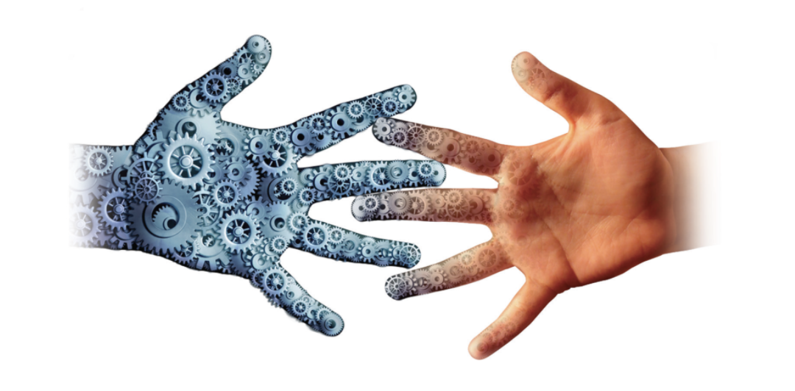
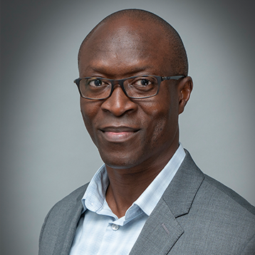
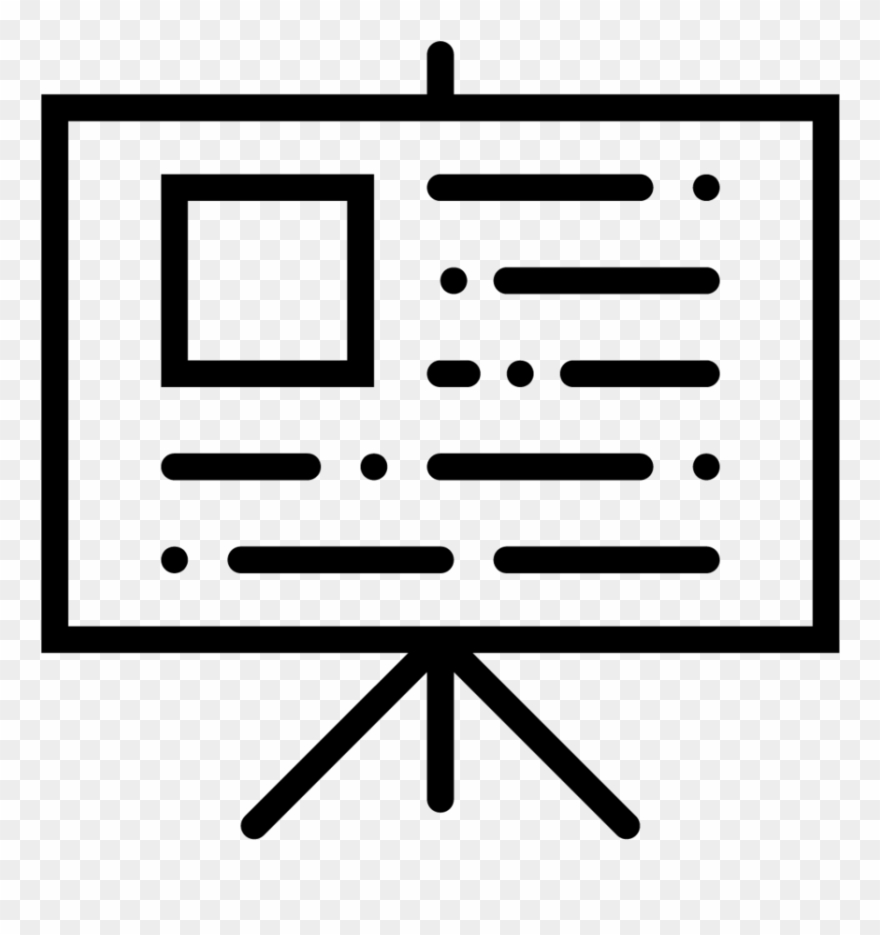
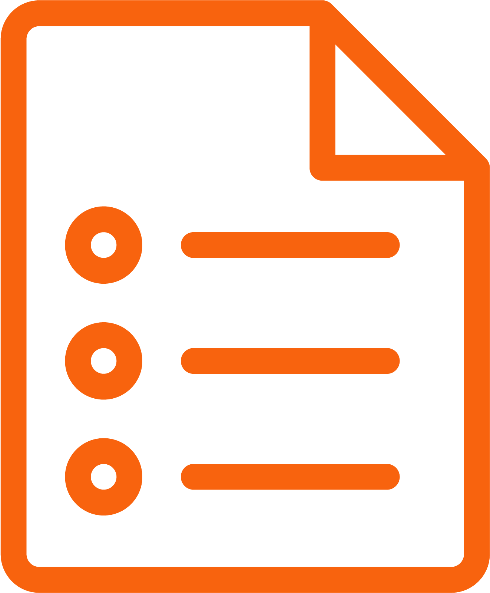

# 66-135: Grand Challenge First Year Seminar - Designing Better Human-AI Futures

### Spring 2022: Tues & Thurs, 11:50am-1:10pm (GHC 4102) **Zoom link sent by email and on canvas (until Feb 1)**

## Important 
 - **All content will be here on github including [schedule](README.md#schedule-subject-to-change)**
 - **All assignments will be on and submitted through [canvas](https://canvas.cmu.edu/courses/27949)**
 - **Class communication and announcements will be primarily through email and Slack**

## Instructors

| [Rayid Ghani](http://www.rayidghani.com) | [Conrad Tucker](https://engineering.cmu.edu/directory/bios/tucker-conrad.html) |
| --- | --- |
|    GHC 8023   Office Hours:    Tue 3-4pm, Wed 4-5pm  |    Wean 4202   Office Hours:   TBD |

Thank you to Molly Steenson for helping create this class and providing valuable advice and content in designing it.

## Course Description
How do we design AI systems that work for everyone and help create a more equitable society? Who needs to be involved in desgining these systems? Designers? Engineers? Social Scientists? Computer Scientists? Statisticians? Policymakers? The Public? What should the AI systems be designed to do and achieve? How do they affect society? How should they affect society? What role can all of us play in creating a future where AI can help us become a more equitable society?

In this class, through creating, sharing, watching, debating, playing, discussing, engaging, observing, and reading, we will go over these types of questions, exploring and discussing what AI is, how it affects society, how it's designed today, and how it could and shoud be designed. 

Buzzwords we will use in this class: Artificial Intelligence, Design (Human-Centered Design, Iterative Design, Participatory Design, Value-Sensitive Design), Values (Social, Ethical, Policy, Business), Stakeholders

## What we want you (the students) to learn
- Develop critical and analytical skills on issues related to AI and how it impacts people, the public, and society
- Familiarize yourself with how AI systems are affecting different aspects of society
- Understand how these AI systems are being designed, developed, and evaluated today
- Experience collaborating with diverse and representative stakeholders that should be involved in the design of AI systems
- Explore how these AI systems could (and should) be designed, developed, and evaluated
- Develop and communicate your perspectives on AI systems to a broad audience

## Class Structure and Topics
This class introduces students to the opportunities and challenges in building human-AI collaborative decision-making systems for societal domains such as health, education, criminal justice, transportation, education, and employment.  We take a design approach to issues around the development of AI systems, including working with communities and stakeholders to identify what the AI system is being designed to achieve, designing the system to attempt to achieve those values, and evaluating it on how it impacts humans and society.  We approach the design of AI as a system that needs continual improvement and redesign in order to reduce the risk of biases that may be inherent not only in the data acquired to develop the AI system, but also the biases of the teams that design the AI algorithms, the biases in the design of the AI algorithms themselves, as well as biases in how actions are taken using the outputs of the AI system.  

**Module 1: Intro and Primer on AI and Design Thinking**
- Intro to AI
  - AI Use cases
    - AI and Business Case Studies
    - AI and Society Case Studies
  - What is AI?
    - What can it do?
    - How does it do what it does?
    - How is it designed?
- Intro to Design Thinking, Value-Sensitive and Human-Centered Design, and Participatory Research Methods
  - Human-Centered Design
  - Value-Sensitive Design
  - Participatory Research Methods

**Module 2: What values should an AI system have?**
- Intro to ethics and value systems
- Examples
- How to infer the values of an existing system?
- How to collaboratively and inclusively determine the values a system should have?

**Module 3: How do you design an AI system to achieve its intended values?**
- What components should you include?
- How should each component be designed?
- What data should the system use?
- What goals should it have?
- How should it be instructed/programmed to achieve those goals?

**Module 4: How do you validate that the AI system achieved those values?**
- What should the evaluation methodology be?
- What role do qualitative methods play?
- What role do quantitative methods play?
- Examples and Case Studies

**Module 5: How do you detect biases and what can you do to mitigate its equity impacts?**
- What does it mean for an AI system to be biased?
- Sources of bias in AI systems
- How to detect the different types of biases
- How to reduce them?
- How to mitigate their equity impact?

## Grading
You will be fine if you engage with the content, with your fellow students, with the guest speakwers, and with us (the instructors). We want you to participate nd contribute to the class - through being there, and through discussion, debate, and writing.

- Team Project (60%):
  - Project Proposal (5%)
  - Project Assignments (15%)
  - Project Presentations (20%)
  - Project Reports (20%)
- Reflections and quizzes on readings and concepts (10%)
- Class attendance, discussion, and participation (20%)
- Submitting weekly reflections (10%)

## Team Projects

Students will form teams and propose an area where AI is affecting society to focus on for the semester. These areas may include issues such as healthcare, hiring, entertainment, criminal justice, social networks, education, etc. The project will have the following components:

- **Background research**: What types of AI systems have been developed in this areas? What do they do? Who has designed them? Who is using them? How well are they working? What are some benefits of it? What are some criticisms? How much information is available about them?
- **Existing Values**: What ethical, social, and business values have been encoded in the current systems? How (and by whom) are the tradeoffs determined?
- **Desired Values**: What values should it have? Who needs to be involved in determining these values? How should those values be disclosed and verified?
- **AI System Design and Development**: What AI components are needed to build a system that achieves the desired values? How should they be put together? What should they  
- **AI System Validation**: How will you validate that the AI system is doing what it was designed to do? How will you validate that it is having the impact it was designed to have?
- **Dealing with Bias and Equity**: What could be some of the biases that could be embedded in the AI system? How could it impact equity for specific groups affected by the AI system?

### Propject Assignments

Each team will submit short assignments, do presentations, and lead as well as participate in discussions around these components for the issue you propose to work on through the semester.
1. [Project Proposal (Due Feb 7th)](https://canvas.cmu.edu/courses/27949/assignments/457363)
2. [Peer Reviews of the Project Proposal]()
3. Project Proposal Presentation (5 minute presentation in class)
4. Intermediate writing and presentation assignments throughout the semester
5. Final Project Report (due the week of finals)
6. Final Project Presentation (last week of classes)

## Schedule (subject to change)

### Jan 18:	Intro and Class Overview

-   [Lecture Slides](https://docs.google.com/presentation/d/1nineFv6WIXuPoNPEh03OrgxI873mowph5y0ozxyXZLM/edit#slide=id.p)

### Jan 20:	How is AI being used today in the business world?

-  [Lecture Slides](https://docs.google.com/presentation/d/1ZIfrAq4kdhIakNvwDRz4Zu9SoVZ4YMRBRC1pkXUS1k0/edit#slide=id.p)

**Before Class**: Read or watch at least one of the articles and videos below (and at least skim the others)  and come to class prepared to discuss them.

*Readings and Videos:*
- [27 Examples of Artificial Intelligence Shaking Up Business as Usual](https://builtin.com/artificial-intelligence/examples-ai-in-industry)
- [The Algorithms that make Instacart Roll](https://spectrum.ieee.org/the-algorithms-that-make-instacart-roll)
- Self Driving Cars: [CNN tests a 'full self-driving' Tesla](https://www.youtube.com/watch?v=2PMu7MD9GvI),[Self Driving Trucks](https://www.youtube.com/watch?v=vMXivgUGVn8)
- [50 AI Examples from thje World's biggest Companies](https://www.manceps.com/ai-examples)
- [Robots abd Retail](https://youtu.be/0e0fdD5DpEI) A BBC Video

### Jan 25:	How is AI being used to tackle societal issues?
-  [Lecture Slides](https://docs.google.com/presentation/d/1GuuZGcMuUWKEQtc6V7eD4YptIGrUVc6JhJl53CrUPlM/edit#slide=id.g10f765bcf59_1_0)

**Before Class**: Read or watch at 2-3 of the articles and videos below (and at least skim the others) and come to class prepared to discuss them.
*Readings and Videos:*
- [AI for Social Good - Overview Paper](https://arxiv.org/pdf/1901.05406.pdf)
- [Matching people in need to social services to benefits](https://www.youtube.com/watch?v=v8lxZnZh6EM&list=PLwU5UOjUFg4K2CM82DNToTyd6lz0oh06i&index=5)
- [Reducing Jail Recidivism](https://www.youtube.com/watch?v=9-1H8I8wteU&list=PLwU5UOjUFg4K2CM82DNToTyd6lz0oh06i)
- [Prioritizing EPA inspections to Reduce Hazardous Waste Disposal Violations](https://www.youtube.com/watch?v=mruBVPs9Ylg&list=PLwU5UOjUFg4Jg-042dlO_3uesiwyKy8sF)
- [Early Screenings to Reduce Type II Diabetes](https://www.youtube.com/watch?v=SFPVAj8Fefs&list=PLUsfTziJs0NXQoHHURLoZMr4wbH_6PWYU)
- [Proactive Lead Inspections to Reduce Lead Poisoning in Children](https://www.youtube.com/watch?v=DbplLXRQquI)
- [How Science Could Help Prevent Police Shootings](https://www.motherjones.com/politics/2016/07/data-prediction-police-misconduct-shootings/), [Additional article](https://fivethirtyeight.com/features/we-now-have-algorithms-to-predict-police-misconduct/)

 [*Assignment:*](https://canvas.cmu.edu/courses/27949/assignments/457467) Submit the topics (on canvas) you're interested in for your class project in order for us to make teams.

### Jan 27:	What is AI, what can it do, and how does it work	

-   [Lecture Slides](https://docs.google.com/presentation/d/1ir48mdHdzQgehYTZLEEF25RAGMKJ_l37xX-AzaiHS7g/edit#slide=id.p)

*Readings:*
- You look like a thing and I love you, by Jannelle Shane [Chapters 1 and 2 - canvas link](https://canvas.cmu.edu/files/7588921/download?download_frd=1)
- [Machine Learning](https://textbook.coleridgeinitiative.org/chap-ml.html) (Book Chapter from Big Data and Social Science). Read sections 7.1 through 7.5

### Feb 1:	What is AI, what can it do, and how does it work			
*Readings and Videos:*
- [Lecture Video from 10301 Class at CMU](https://scs.hosted.panopto.com/Panopto/Pages/Viewer.aspx?id=bdad08bc-69ac-4ece-a724-ae2201217e37) (Taught by Matt Gormley) (Watch the first hour)

### Feb 3:	What is AI, what can it do, and how does it work	

### Feb 8:	Design Thinking and AI
- Useless AI workshop	(with [Molly Steenson](http://www.girlwonder.com/)) 

 [*Assignment:*](https://canvas.cmu.edu/courses/27949/assignments/457363) Project Proposal due Feb 7th

### Feb 10:	Project Proposal Presentations		
 [*Assignment:*](https://canvas.cmu.edu/courses/27949/assignments/462031) Project Proposal Presentation (in class)

### Feb 15:	How do we figure out what AI we should build
 - Intro to Ethics and Value Systems: Guest Lecture by [Alex London](https://www.cmu.edu/dietrich/philosophy/people/faculty/london.html)	
 
*Readings:*
- A Theory of Justice by Rawls, J. 1971. Chapter 1: Justice as Fairness, pp. 1-19. [Available Online](https://github.com/dssg/mlforpublicpolicylab/blob/master/12%20-%20Algorithmic%20Bias%20and%20Fairness%20Pt%201/RawlsJustice.pdf)

 [*Assignment:*](https://canvas.cmu.edu/courses/27949/assignments/462030) Project Proposal Reviews (Due Feb 14th)

### Feb 17:	How do we figure out what AI we should build		
*Readings:*
- [User Needs + Defining Success](https://pair.withgoogle.com/chapter/user-needs/)

### Feb 22:	How do we figure out what AI we should build
- Guest Lecture by [Sarah Fox](https://www.sarahfox.info/)

### Feb 24:	How do we figure out what AI we should build
 - Value Sensitive Design Workshop	(with Molly Steenson)

*Readings:*
 - [Human values matter: why value-sensitive design should be part of every UX designer’s toolkit](https://uxdesign.cc/human-values-matter-why-value-sensitive-design-should-be-part-of-every-ux-designers-toolkit-e53ffe7ec436)
 - [Value Sensitive Design and Information Systems](http://citeseerx.ist.psu.edu/viewdoc/download?doi=10.1.1.138.1155&rep=rep1&type=pdf)(Skim this reading)

### Mar 1:	How do we figure out how to tell AI what it needs to do			

### Mar 3:	How do we figure out how to tell AI what it needs to do

### Mar 8: Spring Break	(No Class)

### Mar 10:	Spring Break	(No Class)		

### Mar 15:	How do we figure out how to tell AI what it needs to do

### Mar 17:	How do we figure out how to tell AI what it needs to do		

### Mar 22:	Presentations		

### Mar 24:	How do we evaluate and monitor what has been built

### Mar 29:	How do we evaluate and monitor what has been built

### Mar 31:	How do we evaluate and monitor what has been built	

### Apr 5:	How do we evaluate and monitor what has been built	

### Apr 7:	No Class		

### Apr 12:	Bias and AI deeper dive			

### Apr 14:	Bias and AI deeper dive			

### Apr 19	Bias and AI deeper dive		

### Apr 21:	Bias and AI deeper dive			

### Apr 26:	Final Presentations		

### Apr 28:	Final Presentations

### May 5:	Finals Week	(No final for this class)	Final Report Due

## Class attendance and participation 
Class attendance and participation are critical in this course. To account for this, a portion of the final grade is based on your regular attendance and active participation (see grading section). That said, we also recognize that students may need to miss class for a variety of reasons, especially with the situation we are in currently. When you must miss class, please notify us (at least 24 hours in advance except for illness/emergency), so that we can discuss alternative arrangements for catching up on class and associated work. If you encounter extenuating circumstances and must miss more than two classes, please come and discuss with us; we would like to find a way to support you.
 
## Take Care of Yourself
This not just something we're writing and saying but we sincerely mean. Take care of yourself - mentally, physically, and in any other way you can think of. 

But also, use this class as an opportunity to get to know your classmates and have conversations you might not have otherwise had. Seek out connections with each other and with us, and catch up with each other in all the online modes you use until we can (physically) be in class.

Do your best to maintain a healthy lifestyle this semester by eating well, exercising, avoiding drugs and alcohol, getting enough sleep and taking some time to relax. This will help you achieve your goals and cope with stress. All of us benefit from support during times of struggle. You are not alone. There are many helpful resources available on campus and an important part of the college experience is learning how to ask for help. Asking for support sooner rather than later is often helpful. If you or anyone you know experiences any academic stress, difficult life events, or feelings like anxiety or depression, we strongly encourage you to seek support. Counseling and Psychological Services (CaPS) is here to help: call 412-268-2922 and visit their website at http://www.cmu.edu/counseling/. Consider reaching out to a friend, faculty or family member you trust for help getting connected to the support that can help.
 
### Accommodations for Students with Disabilities:
If you have a disability and have an accommodations letter from the Disability Resources office, I encourage you to discuss your accommodations and needs with us as early in the semester as possible. We will work with you to ensure that accommodations are provided as appropriate. If you suspect that you may have a disability and would benefit from accommodations but are not yet registered with the Office of Disability Resources, I encourage you to contact them at access@andrew.cmu.edu.
 
Diversity Statement: We must treat every individual with respect. We are diverse in many ways, and this diversity is fundamental to building and maintaining an equitable and inclusive campus community. Diversity can refer to multiple ways that we identify ourselves, including but not limited to race, color, national origin, language, sex, disability, age, sexual orientation, gender identity, religion, creed, ancestry, belief, veteran status, or genetic information. Each of these diverse identities, along with many others not mentioned here, shape the perspectives our students, faculty, and staff bring to our campus. We, at CMU, will work to promote diversity, equity and inclusion not only because diversity fuels excellence and innovation, but because we want to pursue justice. We acknowledge our imperfections while we also fully commit to the work, inside and outside of our classrooms, of building and sustaining a campus community that increasingly embraces these core values.

Each of us is responsible for creating a safer, more inclusive environment. Unfortunately, incidents of bias or discrimination do occur, whether intentional or unintentional. They contribute to creating an unwelcoming environment for individuals and groups at the university. Therefore, the university encourages anyone who experiences or observes unfair or hostile treatment on the basis of identity to speak out for justice and support, within the moment of the incident or after the incident has passed. Anyone can share these experiences using the following resources:
- Center for Student Diversity and Inclusion: csdi@andrew.cmu.edu, (412) 268-2150
- Report-It online anonymous reporting platform: reportit.net username: tartans password: plaid

All reports will be documented and deliberated to determine if there should be any following actions. Regardless of incident type, the university will use all shared experiences to transform our campus climate to be more equitable and just.

### Stopping the Spread of All Contagious Illnesses**
Please do not come to class if you feel sick or have symptoms of a potentially contagious illness. Following CMU policy, students that have symptoms of COVID-19 should contact University Health Services (UHS) at 412-268-2157. Even if you know you do not have COVID-19 but have symptoms that may be a sign of other contagious illnesses, such as a cold or flu, please do not come to class. In the past, some students have thought that coming to class even though they were sick would make them seem like a hard worker. However, this culture has changed. The pandemic has underscored that being around other people when you are sick risks spreading the illness to them, and staying home stops transmission throughout the community. Staying home when you are sick shows that you are responsible and that you care about your classmates and the campus community.

